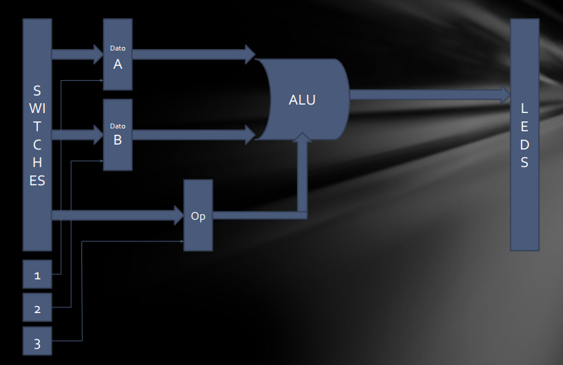
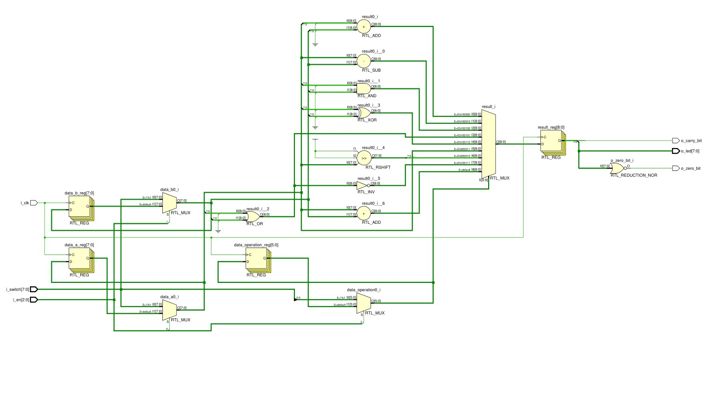
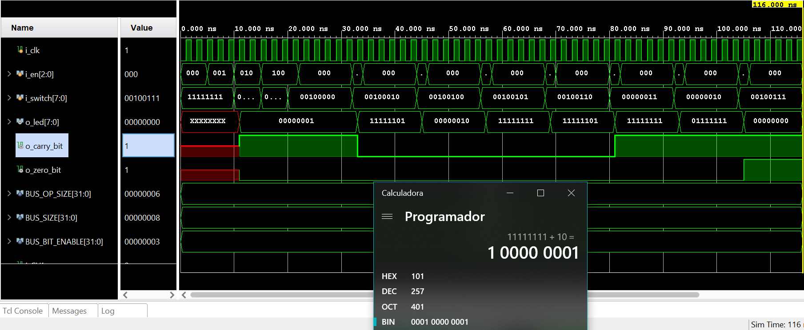

# TP-N°1_ FPGA-ALU

Profesor: Pereyra, Martín

Alumnos:

- Ciordia Cantarella, Francisco | [francisco.ciordia@mi.unc.edu.ar](mailto:francisco.ciordia@mi.unc.edu.ar) | 41.642.397
- Gil, Juan Manuel | [juan.manuel.gil@mi.unc.edu.ar](mailto:juan.manuel.gil@mi.unc.edu.ar) | 41.592.940

FPGA-ALU

12 Septiembre 2022

# Índice

[Índice](about:blank#%C3%ADndice)

[Introducción](about:blank#introducci%C3%B3n)

[Objetivo](about:blank#objetivo)

[Desarrollo](about:blank#desarrollo)

> Caja Negra
> 
> 
> [Código](about:blank#c%C3%B3digo)
> 
> [Módulo ALU](about:blank#m%C3%B3dulo-alu)
> 
> [Módulo de pruebas (TestBench)](about:blank#m%C3%B3dulo-de-pruebas-testbench)
> 

[Diagrama de bloques de la arquitectura](about:blank#diagrama-de-bloques-de-la-arquitectura)

[Imágenes de la simulación](about:blank#im%C3%A1genes-de-la-simulaci%C3%B3n)

[Anexo](about:blank#anexo)

# Introducción

En el siguiente documento usted encontrará información del desarrollo de la construcción de una ALU (Arithmetic Logic Unit) en una FPGA Basys 3. Se configuró utilizando el lenguaje Verilog y se desarrolló y probó en el entorno de Vivado.

# Objetivo

El objetivo es configurar una FPGA para que se comporte como una ALU que soporte las siguientes operaciones:

| Operación | Código |
| --- | --- |
| ADD | 100000 |
| SUB | 100010 |
| AND | 100100 |
| OR | 100101 |
| XOR | 100110 |
| SRA | 000011 |
| SRL | 000010 |
| NOR | 100111 |

La misma debe soportar parametrización, para poder escalarla en futuros trabajos. Además debe contar con un bit para el carry y otro para las operaciones que den cero.

# Desarrollo

El trabajo consistió de dos etapas, por un lado tenemos la construcción del módulo de la ALU propiamente dicha y por otro teníamos el testbench para comprobar que lo hecho fue correcto. Comencemos observando la caja negra de lo propuesto

## Caja Negra

Podemos observar que por un lado vamos a tener las distintas entradas, el Dato A, el Dato B y un código de operación para que la ALU sepa qué debe hacer. Además de eso tenemos 3 bits de enable, los mismos permitirán que el dato ingresado sea leído por la ALU solo si hay un 1 en el bit correspondiente. Por último tenemos una salida dónde vamos a tener los bits de datos, y por otro tendremos los de flag, a nivel de código ambos estarán contenidos en un solo array.

## Código

A nivel de configuración como se mencionó anteriormente tenemos la parte del módulo y la del testbench.

### Módulo ALU

El módulo posee 4 bus parametrizables, uno para el dato A, otro para el dato B, uno para el código de operación, y uno para los leds de salida. A su vez se cuenta con dos salidas, una para el bit de carry y otra para el bit de zero.

Se crea un registro del tamaño del bus de salida más un bit extra que se utiliza para el carry.

Luego se procede a hacer la asignación de los cables de salida que va a ser result pero solo del bit 7 al 0. Luego se asigna el carry al bit 8 del result, también un cable. Por último se asigna el bit de zero que es igual a la negación de una operación bit a bit del bus de salida.

Se utiliza un bloque always para una implementación procedural que consiste en un switch para identificar la operación y luego proceder a realizar la lógica de la misma.

1. Suma: se le concatena un bit extra a cada operando (para el carry) y se realiza la suma.
2. Sustracción: al operando A se le resta el operando B sin más preámbulo.
3. AND Lógica: se realiza la and entre el operando A y B con el operador (“ & ”) sin ningún otro proceso.
4. OR Lógica: ídem anterior, solo que con el operador or (“ | ”).
5. XOR Lógica: ídem anterior, solo que con el operador xor (“ ^ ”).
6. SRA (Shift Right Arithmetic): se deben desplazar todos los bits hacia la derecha, el bit menos significativo pasa a ser el más significativo, el más significativo pasa a ser el segundo más significativo y así sucesivamente. Esto se consiguió con un juego de concatenaciones de bits.
7. SRL (Shift Right Logic): se ingresa un cero por la izquierda para desplazar todos los bits hacia la derecha, esto se puede conseguir con el operador (“ >> ”).
8. Logical NOR: se realiza una OR normal con el operador (“ | “) y se niega el resultado.
9. Se define la suma como operación default.

### Módulo de pruebas (TestBench)

Para corroborar el correcto funcionamiento del módulo ALU se configura un módulo de pruebas, el mismo recibe las mismas entradas y salidas que un módulo ALU, de esta manera puede crear una instancia del mismo.

Definimos un valor “mocked” para el dato A, el dato B y el código de operación, luego llamamos a cada operación realizando una espera de unos pocos milisegundos entre ellas para que puedan ser observadas en la simulación.

# Diagrama de bloques de la arquitectura

El diagrama de bloques de la arquitectura lo obtenemos con la herramienta vivado, a continuación se adjunta la imagen

Notar como se autogeneran algunos módulos de hardware que vivado interpretó.

# Imágenes de la simulación

A continuación se adjuntan imágenes de la simulación en vivado como resultado del testbench

Se puede observar que el carry es igual a 1 en la suma dado que 255 + 2 excede la representación en 8 bits. A su vez podemos apreciar que el bit de zero se pone en 1 cuando ejecutamos la operación de NOR ya que el resultado de los dos operando es justamente cero.

Notar que los cambios de operación se van a dar a medida que vamos colocando en 1 el bit más significativo del enable qué es el que se corresponde con el bus de operaciones, es decir, el valor será seteado en el momento que ese bit sea puesto a 1.

Las demás operaciones marcan los resultados esperados y pueden ser comprobados con una calculadora de programador.

# Update

Si se revisa la fecha de los commits, a raíz de las correcciones hechas en la clase, decidimos hacer un par de cambios que se ven reflejados en el informe. Como cambios de nombres respetando los estándares o la implementación del switch en lugar de una entrada para cada uno de los datos.

# Anexo

Repositorio en GitHub: [GitHub/FPGA-ALU](https://github.com/JuanManuel-Cloud/FPGA-ALU)
